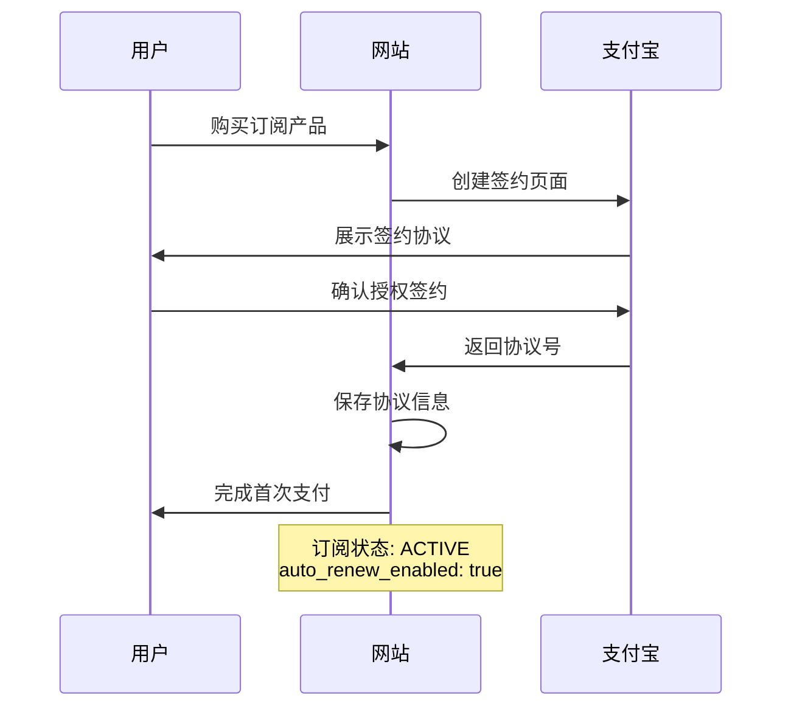
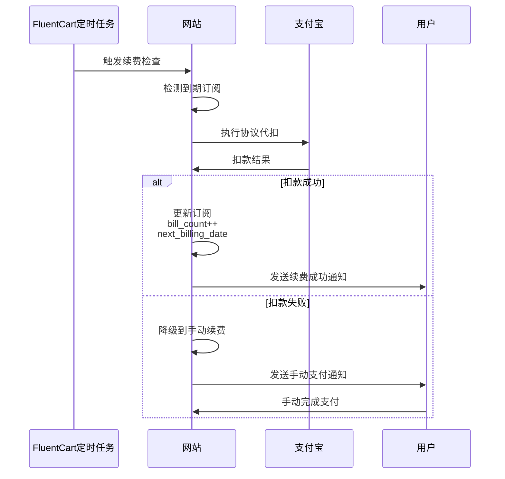
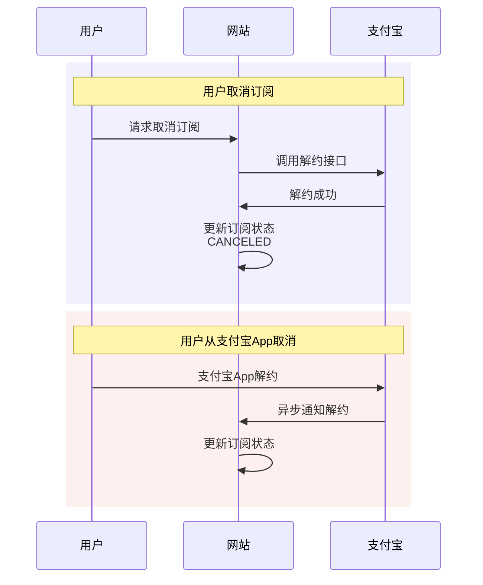

# 支付宝周期扣款（自动续费）配置指南

## 功能概述

支付宝周期扣款功能允许商家在用户授权后，按照约定的周期和金额自动从用户支付宝账户扣款，实现真正的自动续费。

### 适用场景

- ✅ 会员订阅服务（月度/年度会员）
- ✅ SaaS 服务续费
- ✅ 在线课程订阅
- ✅ 云服务/托管服务
- ✅ 定期配送服务
- ✅ 保险/租赁费用

### 功能优势

| 对比项 | 自动扣款 | 手动续费 |
|--------|---------|---------|
| 用户体验 | ⭐⭐⭐⭐⭐ 无感知自动续费 | ⭐⭐⭐ 需手动操作 |
| 续费成功率 | 95%+ | 60-70% |
| 用户流失率 | 低 | 中高 |
| 运营成本 | 低（自动化） | 高（催费通知） |
| 适用周期 | 长期订阅 | 短期/临时订阅 |

## 开通流程

### 步骤 1：申请支付宝周期扣款权限

1. **登录支付宝开放平台**
   - 访问：https://open.alipay.com/
   - 使用企业支付宝账号登录

2. **创建或进入应用**
   - 控制台 → 我的应用
   - 选择现有应用或创建新应用

3. **申请周期扣款功能**
   - 应用详情 → 产品管理
   - 搜索「周期扣款」或「代扣」
   - 点击「签约」按钮

4. **填写申请资料**
   需要提供：
   - 营业执照
   - 业务场景说明
   - 预计月交易量
   - 商品/服务截图
   - 用户协议/服务条款

5. **等待审核**
   - 通常 3-5 个工作日
   - 审核通过后会收到邮件通知

6. **获取产品码**
   - 审核通过后在应用详情可查看
   - 常见产品码：
     - `GENERAL_WITHHOLDING_P` - 通用代扣
     - `CYCLE_PAY_AUTH_P` - 周期付款授权

### 步骤 2：配置插件

1. **进入 FluentCart 设置**
   ```
   WordPress 后台 → FluentCart → Settings → Payment Methods → Alipay
   ```

2. **启用周期扣款**
   - 找到「Subscription & Recurring Payment」部分
   - ✅ 勾选「Enable automatic recurring payment via Alipay agreement」

3. **填写产品码**
   - Personal Product Code 字段
   - 输入支付宝提供的产品码（例如：`GENERAL_WITHHOLDING_P`）

4. **保存设置**
   - 点击「Save Settings」按钮

### 步骤 3：测试验证

#### 3.1 沙箱测试

1. **配置沙箱环境**
   - FluentCart → Settings → Store Settings
   - Order Mode 选择「Test」

2. **使用沙箱账号**
   - 登录支付宝沙箱：https://openhome.alipay.com/develop/sandbox/app
   - 获取测试买家账号信息

3. **创建测试订阅产品**
   ```
   FluentCart → Products → Add New
   - Product Type: Subscription
   - Billing Interval: Month
   - Recurring Amount: ¥10
   - Setup Fee: ¥1 (可选)
   - Trial Period: 0 天（测试时建议不设试用期）
   ```

4. **执行测试流程**
   - 前端购买订阅产品
   - 选择支付宝支付
   - 应该跳转到协议签约页面
   - 使用沙箱买家账号登录并确认授权
   - 完成首次支付
   - 返回网站，检查订阅状态

5. **验证协议信息**
   ```
   WordPress 后台 → FluentCart → Subscriptions
   - 找到测试订阅
   - 查看 Meta Data
   - 确认存在以下字段：
     * alipay_agreement_no: AGR_xxx
     * alipay_agreement_status: active
     * auto_renew_enabled: true
   ```

#### 3.2 生产测试

⚠️ **在正式环境测试前，请确保**：
- ✅ 沙箱测试完全通过
- ✅ 已将 Order Mode 切换为「Live」
- ✅ 配置了正式环境的支付宝凭证
- ✅ 创建真实的低价测试产品（如 ¥0.01）

## 工作流程详解

### 初始订阅流程



### 自动续费流程



### 协议管理流程



## API 接口说明

### 创建签约

```php
// src/Subscription/AlipayRecurringAgreement.php

$result = $recurring->createAgreementSign($subscription, $orderData);

// 参数：
// - $subscription: FluentCart 订阅模型
// - $orderData: 包含 transaction_uuid, order_id

// 返回：
// [
//     'status' => 'success',
//     'redirect_url' => 'https://openapi.alipay.com/...',
//     'external_agreement_no' => 'AGR_123_1234567890'
// ]
```

### 执行代扣

```php
$result = $recurring->executeAgreementPay($subscription, $amount, $orderData);

// 参数：
// - $subscription: 订阅模型（需有 vendor_subscription_id）
// - $amount: 扣款金额（分）
// - $orderData: 订单数据

// 返回：
// [
//     'status' => 'success',
//     'trade_no' => '2024011122001234567890',
//     'message' => 'Renewal payment successful.'
// ]
```

### 查询协议

```php
$result = $recurring->queryAgreement($agreementNo);

// 返回：
// [
//     'status' => 'NORMAL',  // NORMAL-正常, STOP-暂停
//     'sign_time' => '2024-01-01 00:00:00',
//     'valid_time' => '2025-01-01 00:00:00'
// ]
```

### 解约

```php
$result = $recurring->unsignAgreement($subscription);

// 返回：true 或 WP_Error
```

## 常见问题

### Q1: 如何查看订阅是否使用了自动续费？

A: 在 FluentCart 订阅管理页面，查看订阅的 Meta Data：
```
alipay_agreement_status: active  → 已启用自动续费
auto_renew_enabled: true         → 自动续费开关
vendor_subscription_id: AGR_xxx  → 支付宝协议号
```

### Q2: 自动扣款失败后会怎样？

A: 插件有智能降级机制：
1. 首次扣款失败 → 自动重试（最多3次）
2. 重试失败 → 降级到手动续费模式
3. 发送邮件通知用户手动支付
4. 用户完成手动支付后订阅继续

### Q3: 用户如何查看/取消协议？

A: 用户可以通过以下方式管理：
1. **支付宝App**：我的 → 设置 → 支付设置 → 免密支付/自动扣款
2. **网站后台**：订阅管理页面 → 取消订阅
3. 两种方式都会同步到系统

### Q4: 协议有效期多长？

A: 根据订阅类型自动计算：
- **有限次数订阅**：总周期数 × 计费间隔
- **无限订阅**：10年（120个月）
- 支持最长不超过支付宝限制（通常3-5年）

### Q5: 如何处理用户余额不足？

A: 支付宝会自动处理：
1. 扣款日尝试扣款
2. 余额不足 → 扣款失败
3. 返回失败通知到系统
4. 系统降级到手动续费
5. 发送通知要求用户充值并手动支付

### Q6: 周期扣款有金额限制吗？

A: 是的，支付宝有限制：
- **单笔限额**：通常 ¥5,000
- **每日限额**：¥10,000
- **每月限额**：¥50,000
- 具体限额取决于用户的支付宝账户等级和商家签约协议

### Q7: 可以修改扣款金额或周期吗？

A: 不能直接修改现有协议。需要：
1. 解除旧协议
2. 创建新订阅
3. 重新签约新协议
4. FluentCart 的升级/降级功能会自动处理

### Q8: 沙箱环境和生产环境有什么区别？

A: 主要区别：
- **沙箱**：测试环境，不实际扣款，使用测试账号
- **生产**：正式环境，真实扣款，需要用户授权
- 沙箱的协议号、产品码与生产环境不同
- 切换环境时需要重新配置

## 最佳实践

### 1. 用户体验优化

✅ **清晰的协议说明**
```php
// 在产品页面展示
- 扣款周期：每月1号
- 扣款金额：¥99/月
- 可随时取消，无违约金
- 自动续费，无需手动操作
```

✅ **续费提前通知**
- 扣款前3天发送邮件提醒
- 告知下次扣款时间和金额
- 提供取消链接

✅ **扣款失败处理**
- 明确告知失败原因
- 提供多种补救方案
- 避免立即停止服务

### 2. 安全措施

✅ **签名验证**
- 所有回调都验证支付宝签名
- 防止伪造通知

✅ **协议状态检查**
- 扣款前检查协议是否有效
- 避免对已取消协议扣款

✅ **金额校验**
- 扣款金额与订阅金额一致性检查
- 防止金额篡改

### 3. 监控和日志

✅ **关键操作日志**
```php
// 自动记录以下事件
- 协议签约成功/失败
- 自动扣款成功/失败
- 协议解约
- 降级到手动续费
```

✅ **指标监控**
- 自动续费成功率
- 降级手动续费比例
- 用户主动取消率
- 扣款失败原因分析

## 技术支持

### 日志查看

所有周期扣款相关操作都会记录日志：

```bash
# WordPress 调试日志
/wp-content/debug.log

# 搜索关键词
- "Recurring Agreement"
- "Agreement Pay"
- "Agreement Sign"
- "executeAgreementPay"
```

### 调试模式

启用 WordPress 调试：
```php
// wp-config.php
define('WP_DEBUG', true);
define('WP_DEBUG_LOG', true);
define('WP_DEBUG_DISPLAY', false);
```

### 获取帮助

- 文档：https://www.wpdaxue.com/fluentcart-alipay
- 支持：support@wpdaxue.com
- 支付宝开发者社区：https://forum.alipay.com/

## 附录

### A. 支付宝开放平台资源

- 开放平台首页：https://open.alipay.com/
- 周期扣款文档：https://opendocs.alipay.com/open/20190319114403226822
- 沙箱环境：https://openhome.alipay.com/develop/sandbox/app
- 开发者论坛：https://forum.alipay.com/

### B. 产品码参考

| 产品码 | 名称 | 说明 |
|--------|-----|------|
| GENERAL_WITHHOLDING_P | 通用代扣 | 最常用，适合大部分订阅场景 |
| CYCLE_PAY_AUTH_P | 周期付款授权 | 适合固定周期固定金额 |
| BANK_CARD_WITHHOLDING_P | 银行卡代扣 | 需绑定银行卡 |

### C. 错误码参考

| 错误码 | 说明 | 处理方案 |
|--------|-----|---------|
| ACQ.AGREEMENT_INVALID | 协议无效 | 检查协议状态，可能已解约 |
| ACQ.BUYER_BALANCE_NOT_ENOUGH | 余额不足 | 降级到手动续费 |
| ACQ.AGREEMENT_EXPIRED | 协议过期 | 重新签约 |
| ACQ.SYSTEM_ERROR | 系统错误 | 稍后重试 |

---

**版本**: 1.1.0  
**更新时间**: 2025-10-20  
**适用插件版本**: wpkj-fluentcart-alipay-payment 1.1.0+
